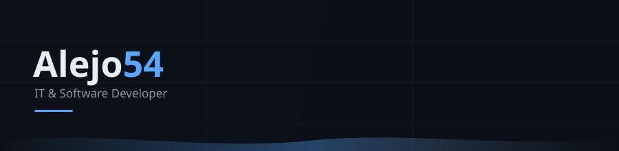
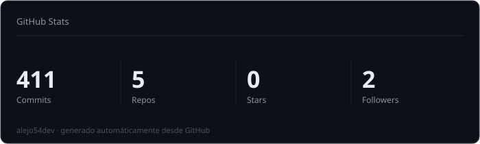
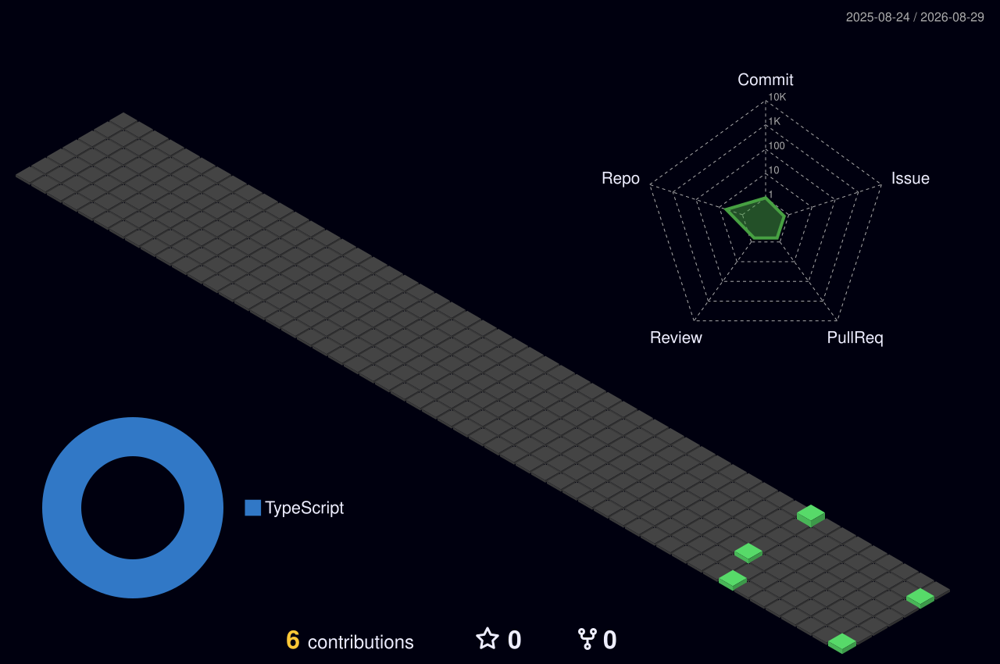

# Hola 👋 Soy Alejandro Carraretto

IT & Software Developer. Analista programador de raza, con años de software de negocios a cuestas. Me gustan los desafíos raros: los que obligan a pensar, no a copiar.

## Quién soy

Me especializo en **software de negocios**. Construyo sistemas a medida que resuelven problemas reales, sin humo. Ante cada problema elijo la tecnología que corresponde — las pragmáticas, las clásicas y las ideales, según lo que haya que resolver.

## Cómo trabajo

- **Software de negocios** — sistemas a medida, simples por diseño.
- **Full-stack web** — PHP, TypeScript/Bun, HTML/CSS y SQLite como motor de datos.
- **Desafíos raros** — los problemas difíciles me enganchan; la tecnología es mi herramienta.
- **IA como asistente** — la uso como todos, pero el orquestador soy yo. Nada al libre albedrío.

Soy analista programador de raza, conozco la tecnología y, por ende, **yo tengo el control — y no al revés**.

## Contacto

- 🌐 Web: [alejo54.ar](https://alejo54.ar)

## Stack

## GitHub Stats

## Actividad

---

[alejo54.ar](https://alejo54.ar)
